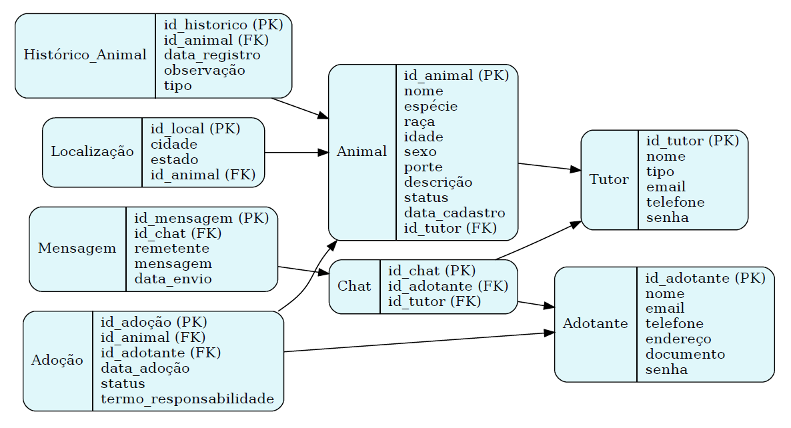

# App Adote-me

Aplicativo mobile para adoção de animais desenvolvido com React Native e Expo. 

Documentação do projeto pode ser encontrada em [documentacao.pdf](./documentacao.pdf) na raiz desse repositório 

## Alunos Desenvolvedores

- Alexsandra Oliveira de Jesus
- Ana Karolini Blooemer Noth
- Julia Petrucci dos Santos
- Thalita Pereira Alfonso
- Henrique Carvalho Silva

## Tecnologias Utilizadas

- React Native
- Expo
- Supabase (Backend e Autenticação)
- React Navigation
- AsyncStorage

## Modelo físico do banco de Dados

As principais entidades com seus atributos, os relacionamentos entre elas, e o diagrama entidade relacionamento (der) se encontram tanto abaixo, quanto em [modelofisicobd/DER.docx](./modelofisicobd/DER.docx) desse repositório. 

<h3>Entidade</h3>

    • Animal
        ◦ Significado: Representa os animais cadastrados no sistema que estão disponíveis para adoção.
        ◦ Atributos: 
            ▪ id_animal: Identificador único do animal.
            ▪ nome: Nome do animal.
            ▪ espécie: Espécie (ex: cão, gato).
            ▪ raça: Raça do animal.
            ▪ idade: Idade estimada.
            ▪ sexo: Sexo do animal.
            ▪ porte: Porte (pequeno, médio, grande).
            ▪ descrição: Informações adicionais sobre o animal.
            ▪ status: Situação do animal (disponível, adotado etc.).
            ▪ data_cadastro: Data de inclusão no sistema.
            ▪ id_tutor: Referência ao tutor responsável pelo animal (chave estrangeira).

    • Tutor
        ◦ Significado: Representa ONGs, abrigos ou tutores independentes que disponibilizam animais para adoção.
        ◦ Atributos:
            ▪ id_tutor: Identificador único.
            ▪ nome: Nome da ONG ou responsável.
            ▪ tipo: Classificação (ONG, Abrigo, Independente).
            ▪ email: Contato de e-mail.
            ▪ telefone: Telefone de contato.
            ▪ senha: Credencial de acesso ao sistema.
            ▪ Adotante
            ▪ - Significado: Representa os usuários interessados em adotar um animal.
            ▪ - Atributos:
            ▪ id_adotante: Identificador único.
            ▪ nome: Nome completo do adotante.
            ▪ email: E-mail de contato.
            ▪ telefone: Telefone de contato.
            ▪ endereço: Endereço completo.
            ▪ documento: Número de documento de identificação.
            ▪ senha: Senha de acesso à plataforma.

    • Adoção
        ◦ Significado: Armazena os dados sobre o processo de adoção de um animal.
        ◦ Atributos:
            ▪ id_adoção: Identificador único.
            ▪ id_animal: Animal adotado (chave estrangeira).
            ▪ id_adotante: Adotante responsável (chave estrangeira).
            ▪ data_adoção: Data da solicitação de adoção.
            ▪ status: Estado do processo (em análise, aprovada, rejeitada).
            ▪ Termo_responsabilidade: Indica se o termo foi aceito (booleano).

    • Chat
        ◦ Significado: Representa a comunicação entre tutor e adotante.
        ◦ Atributos:
            ▪ id_chat: Identificador único do chat.
            ▪ id_adotante: Adotante envolvido na conversa.
            ▪ id_tutor: Tutor envolvido na conversa.

    • Mensagem
        ◦ Significado: Armazena as mensagens trocadas entre adotante e tutor no sistema de chat.
        ◦ Atributos:
            ▪ id_mensagem: Identificador da mensagem.
            ▪ id_chat: Chat ao qual a mensagem pertence.
            ▪ remetente: Indica quem enviou (adotante ou tutor).
            ▪ mensagem: Conteúdo textual da mensagem.
            ▪ data_envio: Data e hora do envio.

    • Histórico_Animal
        ◦ Significado: Armazena registros importantes da vida do animal, como vacinação e castração.
        ◦ Atributos:
            ▪ id_historico: Identificador único.
            ▪ id_animal: Animal relacionado ao registro.
            ▪ data_registro: Data da anotação.
            ▪ observação: Texto descritivo sobre o evento.
            ▪ tipo: Classificação do registro (ex: vacinação, castração, comportamento).

    • Localização
        ◦ Significado: Relaciona a cidade e estado em que o animal está disponível.
        ◦ Atributos:
            ▪ id_local: Identificador único da localidade.
            ▪ cidade: Nome da cidade.
            ▪ estado: Estado de localização.
            ▪ Id_animal: Animal associado à localização. 

<h3>Relacionamentos</h3>

    • Tutor-Animal: Um tutor pode cadastrar vários animais, mas cada animal pertence a um único tutor. (1:N)
    • Adotante-Adoção: Um adotante pode realizar várias adoções, mas cada adoção está associada a um único adotante. (1:N)
    • Animal-Adoção: Um animal pode ser adotado uma única vez. (1:1)
    • Adotante-Chat-Tutor: Um chat é criado entre um adotante e um tutor, podendo conter várias mensagens. (1:1:1)
    • Chat Mensagem: Um chat pode conter várias mensagens. (1:N)
    • Animal-Histórico_Animal: Cada animal pode ter vários registros históricos. (1:N)
    • Animal-Localização: Cada animal está vinculado a uma localidade. (1:1)

<h3>Diagrama Entidade Relacionamento (DER)</h3>

 

## Protótipo

Realizado prototipação no FIGMA, segue link do protótipo: https://www.figma.com/design/pVxyLxhcC7pohVNbrZu8Zh/PROJETO-INTEGRADOR?node-id=0-1&t=rTGHXthIWgQUeNW9-1

## Landing Page

Abaixo se encontra a landing page (tela de login) da aplicação, pois como a aplicação não se trata de uma Web Page, mas sim de um App Mobile, não foi utilizado o Git Pages:

 

OBS: Caso ocorra problema de exibição, verificar o arquivo [lp.jpg](./lp.jpg) na raiz desse repositório.

## Demonstração de uso da aplicação

Um video demonstrativo exibindo o uso e a funcionalidade da aplicação pode ser encontrado em [/media/demo.mp4](./media/demo.mp4) desse repositório

